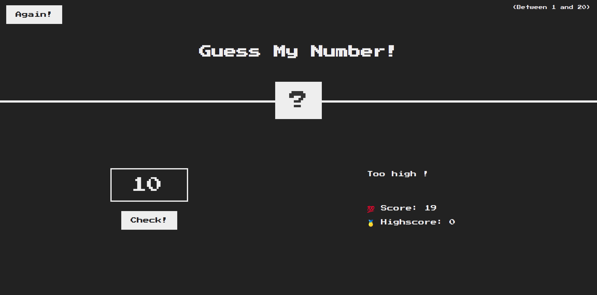
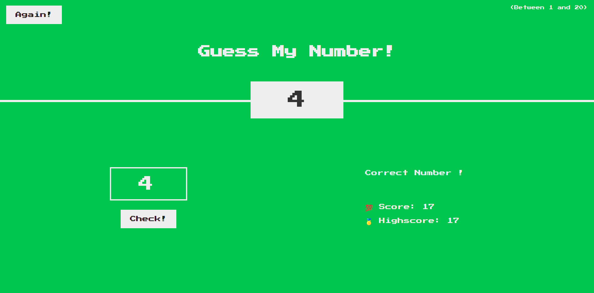

# JSGameGuessMyNumber
Project built during Jonas Schmedtmann's courses on [UDEMY](https://www.udemy.com/course/the-complete-javascript-course/).

[CLICK HERE TO PLAY THE GAME](https://paul21777.github.io/JSGameGuessMyNumber/)

## Screenshots

## What I learned ?
1. What is the DOM and some DOM's methodes
	1. querySelector()
	2. addEventListener()
	4. Changing styles (colors, width)
	5. write and read from textContent

2.  Refactoring the code (The DRY principle)

	- When there is multiple repetition of the code, refactoring allow us to be more confident for example if we have to change any value of a variable and the code is clearer to read and understand. 

3. Learn some new js methods like Math.random(), Math.trunc()

## What to improve ?
1. DRY principle
2. use more arrow functions and ternary condition when possible
3. Commenting my code along the way to code easily
